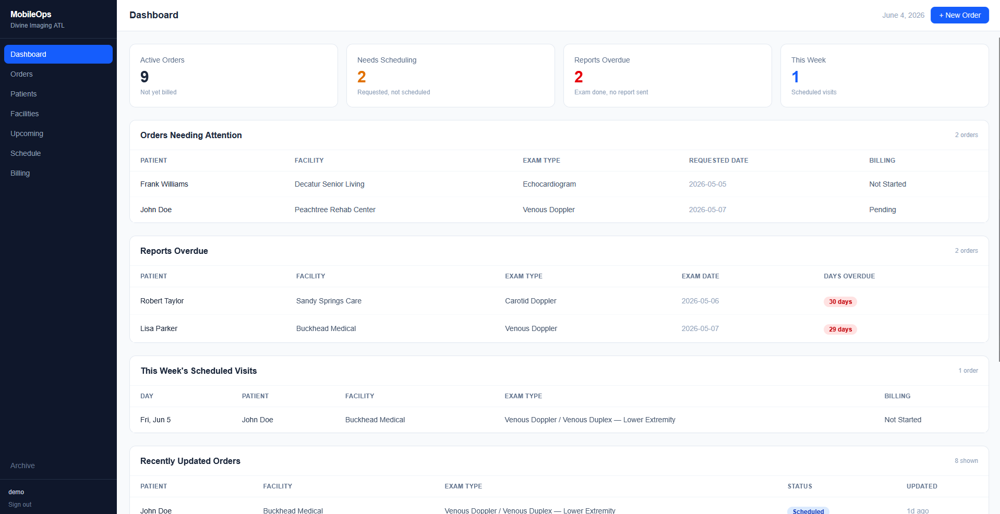
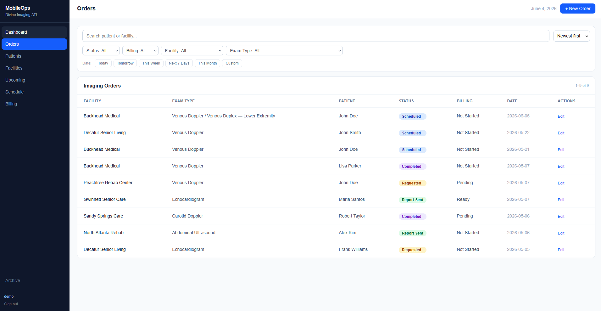
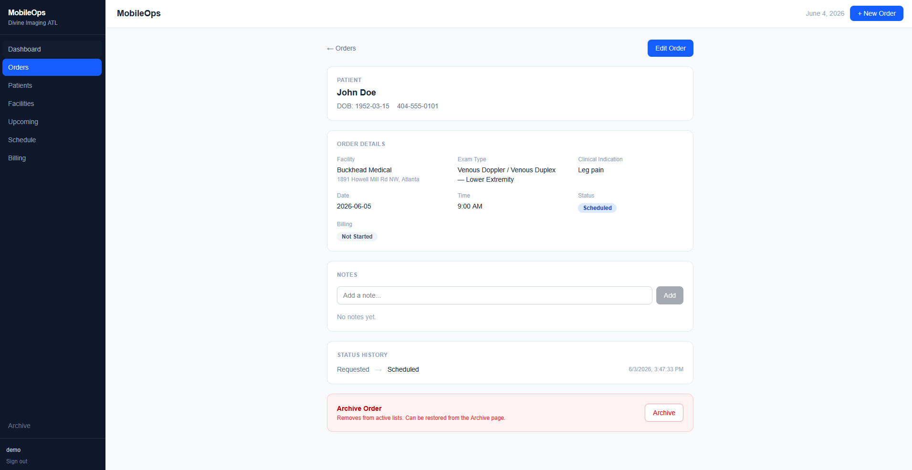
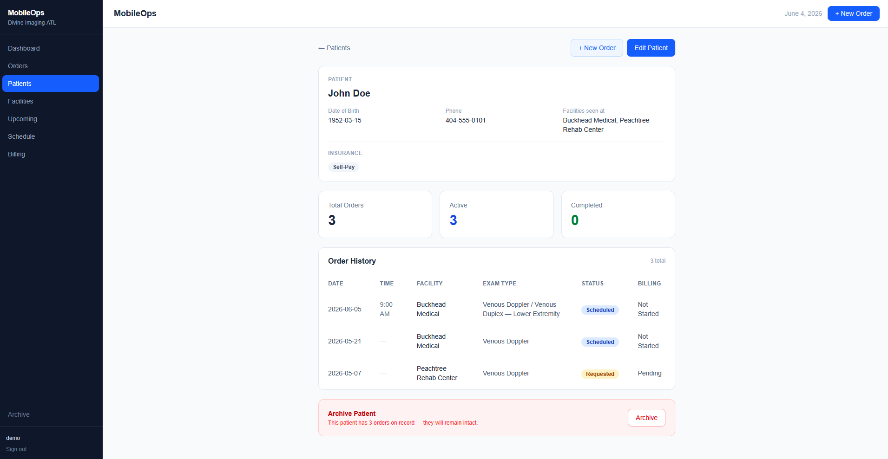
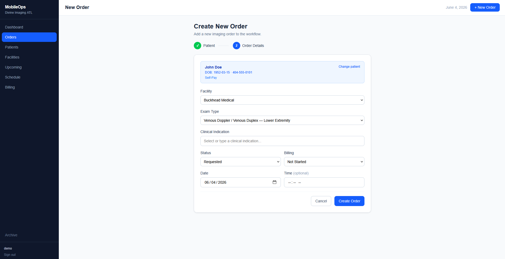

# MobileOps — Ultrasound Operations Dashboard

A production web application built for a mobile diagnostic imaging startup. MobileOps manages the full operational workflow — patients, imaging orders, scheduling, billing, and insurance — in a single real-time interface used daily by the business.

> **Live production app.** Login required — not a demo clone.

---

## Tech Stack

| Layer | Technology |
|---|---|
| Frontend | React 19, Tailwind CSS v4, React Router v6 |
| Backend / Database | Supabase (PostgreSQL) |
| Auth | Supabase Auth |
| Real-time | Supabase Postgres Change Streams |
| Serverless | Supabase Edge Functions (Deno / TypeScript) |
| Deployment | Vercel |

---

## Screenshots

### Dashboard
At-a-glance view of active orders, scheduling gaps, overdue reports, and this week's visits.



### Orders
Full order list with search, status/billing/facility/exam type filters, and date range presets. Inline status updates without opening the record.



### Order Detail
Complete order view with patient info, exam details, clinical indication, insurance and authorization tracking, notes, and full status history.



### Patient Detail
Patient profile with insurance information, order statistics, and full order history.



### Create Order
Two-step order creation — patient search or creation, then order details with clinical indication suggestions per exam type.



---

## Key Features

- **Real-time sync** — Order and patient updates propagate instantly to all active sessions via Supabase Postgres Change Streams, no polling or page refresh needed
- **Auth + session security** — Supabase Auth with inactivity-based auto sign-out to protect patient health data
- **Patient insurance tracking** — Payer, member ID, group number, policy holder, and per-order authorization number with verification status
- **Clinical indication system** — Exam-specific suggestion lists for 14 ultrasound exam types with free-text fallback
- **Appointment reminders** — Supabase Edge Function (Deno/TypeScript) sends per-appointment email notifications to the technician 1 and 2 days before each scheduled exam via Gmail SMTP; duplicate sends prevented by a server-side notification log
- **Date range filtering** — Preset filters (Today, Tomorrow, This Week, Next 7 Days, This Month) and custom from/to range on the orders list
- **Upcoming appointments view** — Chronological list of all future-dated orders grouped by date, as a day-to-day alternative to the calendar
- **Soft archive** — Orders, patients, and facilities are archived rather than deleted, with a full restore flow
- **Row-level security** — Supabase RLS policies on all tables; service role key used only in Edge Functions, never exposed to the client

---

## Project Structure

```
src/
├── components/       # Reusable UI (modals, badges, status select, etc.)
├── context/          # React context providers (Orders, Patients, Facilities, Auth, Toast)
├── data/             # Static data (exam types, clinical indications, insurance payers)
├── lib/              # Supabase client
└── pages/            # Route-level components

supabase/
└── functions/
    └── send-appointment-reminders/   # Deno Edge Function for email notifications
```

---

## Local Development

```bash
npm install
```

Create a `.env.local` file:

```
VITE_SUPABASE_URL=your_supabase_project_url
VITE_SUPABASE_ANON_KEY=your_supabase_anon_key
```

```bash
npm run dev
```
